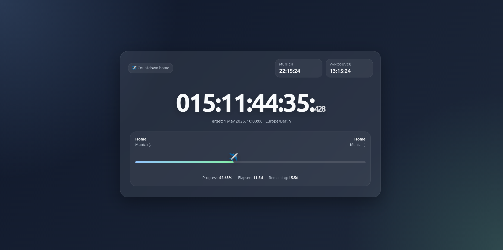

# Countdown to Home ✈️



A beautiful, real-time countdown timer that tracks your journey back home with live timezone clocks and visual progress tracking.

## Features

- ⏱️ **Live Countdown** – Real-time display of days, hours, minutes, seconds, and milliseconds
- 🌍 **Multiple Timezones** – Shows current time in two locations simultaneously
- ✈️ **Journey Progress** – Visual plane animation tracking your progress along the route
- 📊 **Statistics** – Displays elapsed time, remaining time, and journey percentage
- 📱 **Responsive Design** – Beautiful glassmorphism UI that works on all devices
- 🎨 **Modern Aesthetics** – Gradient background, smooth animations, and premium color scheme

## Project Structure

```
countdown-home/
├── index.html      # Main HTML file with semantic markup
├── styles.css      # All styling with CSS custom properties
├── script.js       # JavaScript countdown logic
└── README.md       # This file
```

## Configuration

Edit the following variables in `script.js` to customize your countdown:

```javascript
const journeyStart = new Date('2026-04-04T10:00:00+02:00');
const journeyEnd = new Date('2026-05-01T10:00:00+02:00');
```

### Timezone Configuration

Update the timezone strings in the `Intl.DateTimeFormat` configurations:

```javascript
// Home timezone
timeZone: 'Europe/Berlin'

// Away timezone
timeZone: 'America/Vancouver'
```

Common timezone formats:
- `Europe/Berlin` – Central European Time
- `America/Vancouver` – Pacific Standard Time
- `America/New_York` – Eastern Standard Time
- `Asia/Tokyo` – Japan Standard Time
- `Australia/Sydney` – Australian Eastern Time

[Full list of IANA timezones](https://en.wikipedia.org/wiki/List_of_tz_database_time_zones)

## How It Works

1. **Countdown Calculation** – Compares the current time with the target date
2. **Timezone Display** – Uses browser's `Intl.DateTimeFormat` API for accurate regional times
3. **Progress Tracking** – Calculates percentage based on journey start and end dates
4. **Animation** – Uses `requestAnimationFrame` for smooth, 60fps updates

## Customization

### Colors & Theme

Modify the CSS custom properties in `styles.css`:

```css
:root {
  --bg1: #0f172a;           /* Primary background */
  --bg2: #1e293b;           /* Secondary background */
  --accent: #93c5fd;        /* Primary accent (blue) */
  --accent-2: #86efac;      /* Secondary accent (green) */
  --text: #f8fafc;          /* Text color */
  --muted: #cbd5e1;         /* Muted text color */
}
```

### Cities/Labels

Edit the city names in the HTML:

```html
<div class="city" style="text-align:left;"><strong>Home</strong><span>Munich (:</span></div>
<div class="city" style="text-align:right;"><strong>Home</strong><span>Munich :)</span></div>
```

## Browser Compatibility

- Chrome/Edge 76+
- Firefox 78+
- Safari 14+
- All modern mobile browsers

## Performance

- No external dependencies – pure vanilla JavaScript
- Optimized animations using `requestAnimationFrame`
- CSS transitions for smooth visual updates
- Responsive design without heavy frameworks

## License

Free to use and modify.
